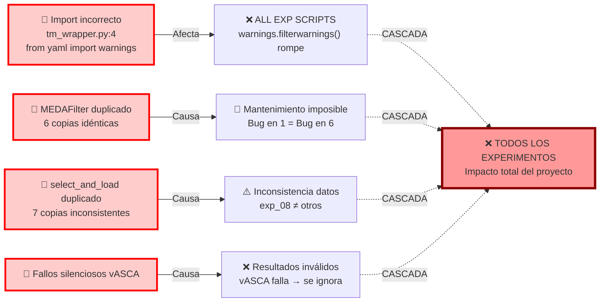
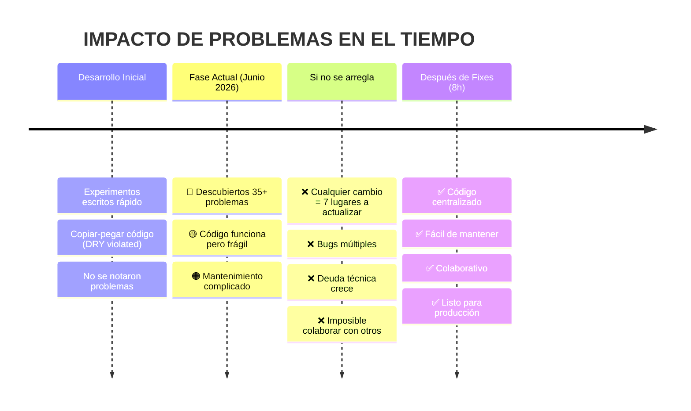

# 🗺️ MAPA VISUAL DE ESTRUCTURA Y PROBLEMAS

## Diagrama de Dependencias del Proyecto

```mermaid
graph TB
    subgraph "📁 data/"
        D1["dataset_simulado_3000.xlsx<br/>3000 × 40"]
        D2["dataset_simulado2.xlsx<br/>50 × 4000"]
        D3["dataset_real.xlsx<br/>82 × 15+"]
    end
    
    subgraph "🔧 src/models/"
        M1["tm_wrapper.py<br/>🔴 BUG LÍNEA 4"]
        M2["r_wrapper.py<br/>✅ OK"]
        M3["r_scripts/<br/>✅ OK"]
    end
    
    subgraph "🎯 src/features/"
        F1["smart_booleanizer.py<br/>✅ OK"]
    end
    
    subgraph "💡 src/interpretability/"
        I1["clinical_translator.py<br/>✅ OK"]
        I2["__init__.py<br/>⚠️ VACÍO"]
    end
    
    subgraph "📊 src/evaluation/"
        E1["benchmark_engine.py<br/>✅ OK"]
    end
    
    subgraph "⚠️ PROBLEMAS EN EXPERIMENTOS"
        EXP1["exp_meda_04_v2.py<br/>🔴 DUPLICA MEDAFilter<br/>🔴 DUPLICA select_and_load"]
        EXP2["exp_05_hybrid.py<br/>🔴 DUPLICA MEDAFilter<br/>🔴 DUPLICA select_and_load"]
        EXP3["exp_06_pure_comparison.py<br/>🔴 DUPLICA MEDAFilter<br/>🔴 DUPLICA select_and_load"]
        EXP4["exp_07_extract_rules.py<br/>🔴 DUPLICA MEDAFilter<br/>🔴 DUPLICA select_and_load"]
        EXP5["exp_08_inverse_hybrid_latent.py<br/>🔴 DUPLICA MEDAFilter<br/>🔴 FALLOS SILENCIOSOS vASCA"]
        EXP6["exp_09_inv_hybrid_svm.py<br/>🔴 DUPLICA select_and_load"]
        EXP7["exp_10_final_translator.py<br/>🔴 DUPLICA MEDAFilter<br/>🔴 DUPLICA select_and_load"]
    end
    
    D1 --> EXP1
    D1 --> EXP2
    D1 --> EXP3
    D1 --> EXP4
    D1 --> EXP5
    D1 --> EXP6
    D1 --> EXP7
    
    M1 --> EXP1
    M1 --> EXP2
    M1 --> EXP3
    M1 --> EXP4
    M1 --> EXP5
    M1 --> EXP6
    M1 --> EXP7
    
    M2 --> EXP1
    M2 --> EXP2
    M2 --> EXP3
    M2 --> EXP4
    M2 --> EXP5
    
    F1 --> EXP1
    F1 --> EXP2
    F1 --> EXP3
    F1 --> EXP4
    F1 --> EXP5
    F1 --> EXP6
    F1 --> EXP7
    
    EXP1 --> RES["results/<br/>Visualizaciones"]
    EXP2 --> RES
    EXP3 --> RES
    EXP4 --> RES
    EXP5 --> RES
    EXP6 --> RES
    EXP7 --> RES
    
    style M1 stroke:red,stroke-width:3px
    style EXP1 stroke:orange,stroke-width:2px
    style EXP2 stroke:orange,stroke-width:2px
    style EXP3 stroke:orange,stroke-width:2px
    style EXP4 stroke:orange,stroke-width:2px
    style EXP5 stroke:red,stroke-width:3px
    style EXP6 stroke:orange,stroke-width:2px
    style EXP7 stroke:orange,stroke-width:2px
```



---

## Flujo de Problemas Críticos



---

## Matriz de Duplicación de Código

```
                        MEDAFilter  select_and_load()
exp_meda_04_v2.py          ✓              ✓
exp_05_hybrid.py           ✓              ✓
exp_06_pure.py             ✓              ✓
exp_07_rules.py            ✓              ✓
exp_08_inverse.py          ✓              ✓
exp_09_inv_svm.py                        ✓
exp_10_translator.py       ✓              ✓
───────────────────────────────────────────
TOTAL COPIAS:              6              7
LÍNEAS DUPLICADAS:         ~300+
MANTENIBILIDAD:            ❌ IMPOSIBLE
```

---

## Timeline de Impacto



---

## Severidad de Problemas - Heat Map

```
CRITICIDAD

🔴 ROJO      🟡 NARANJA    🟠 MARRÓN
DEBE ARREGLARSE URGENTE   Mejora recomendada

import_error         tm_wrapper.py:4
medaq_filter_dup     6 archivos
select_load_dup      7 archivos
vasca_silent_fail    exp_05, exp_08

────────────────────────────────────────

hardcoded_cols       select_and_load
param_inconsistency  n_bins vs num_bins
no_type_hints        TODO

────────────────────────────────────────

missing_predict      r_wrapper.py
empty_init           interpretability/
import_inconsist     tests
error_inconsist      scattered
```

---

## Árbol de Soluciones Recomendadas

```mermaid
graph TD
    MAIN["REFACTORIZACIÓN<br/>6-8 HORAS"]
    
    PHASE1["FASE 1: EMERGENCIAS<br/>0.5 horas"]
    P1A["✅ Fix import<br/>tm_wrapper.py:4"]
    P1B["✅ Error handling<br/>vASCA silent fails"]
    
    PHASE2["FASE 2: ARQUITECTURA<br/>3 horas"]
    P2A["✅ utils/data_loader.py<br/>select_and_load centralizado"]
    P2B["✅ pipelines/meda_filter.py<br/>MEDAFilter centralizado"]
    P2C["✅ Actualizar imports<br/>en 7 exp scripts"]
    
    PHASE3["FASE 3: POLISH<br/>2-3 horas"]
    P3A["✅ Estandarizar n_bins<br/>en toda la codebase"]
    P3B["✅ Agregar type hints<br/>funciones críticas"]
    P3C["✅ Rellenar __init__.py"]
    P3D["✅ Error handling"]
    
    PHASE4["FASE 4: TESTING<br/>1-2 horas"]
    P4A["✅ Unit tests data_loader"]
    P4B["✅ Verificar imports"]
    P4C["✅ Run all exp scripts"]
    
    MAIN --> PHASE1
    MAIN --> PHASE2
    MAIN --> PHASE3
    MAIN --> PHASE4
    
    PHASE1 --> P1A
    PHASE1 --> P1B
    
    PHASE2 --> P2A
    PHASE2 --> P2B
    PHASE2 --> P2C
    
    PHASE3 --> P3A
    PHASE3 --> P3B
    PHASE3 --> P3C
    PHASE3 --> P3D
    
    PHASE4 --> P4A
    PHASE4 --> P4B
    PHASE4 --> P4C
    
    style MAIN stroke:darkgreen,stroke-width:3px,fill:#ccffcc
    style PHASE1 stroke:red,stroke-width:2px,fill:#ffcccc
    style PHASE2 stroke:orange,stroke-width:2px,fill:#ffe6cc
    style PHASE3 stroke:gold,stroke-width:2px,fill:#fffacc
    style PHASE4 stroke:green,stroke-width:2px,fill:#ccffcc
```



---

## Análisis Costo-Beneficio

```
┌─────────────────────────────────────────────────┐
│          COSTO DE NO ARREGLARLO                 │
├─────────────────────────────────────────────────┤
│ Tiempo perdido en futuros cambios:     10+ horas│
│ Bugs multiplicados por duplicación:    7x       │
│ Imposibilidad de colaboración:         SÍ       │
│ Deuda técnica acumulada:              CRÍTICA   │
│ Calidad de código:                     BAJA     │
├─────────────────────────────────────────────────┤
│ TOTAL COSTO A LARGO PLAZO:            20+ horas│
└─────────────────────────────────────────────────┘

┌─────────────────────────────────────────────────┐
│         COSTO DE ARREGLARLO AHORA               │
├─────────────────────────────────────────────────┤
│ Inversión inicial:                   6-8 horas │
│ Beneficio futuro:                    +15 horas │
│ ROI:                                  2-3x     │
│ Beneficio adicional:                           │
│  - Código limpio                        ✅     │
│  - Fácil de mantener                   ✅     │
│  - Pronto para colaboración            ✅     │
│  - Profesional para defensa            ✅     │
└─────────────────────────────────────────────────┘

RECOMENDACIÓN: ARREGLAR AHORA (ROI positivo)
```

---

## Checklist de Validación Post-Fix

Después de aplicar todos los fixes, verificar:

```
DESPUÉS DE ARREGLOS:

□ tm_wrapper.py: import warnings correcto
□ MEDAFilter: un archivo centralizado (src/pipelines/meda_filter.py)
□ select_and_load_dataset: un archivo centralizado (src/utils/data_loader.py)
□ Todos los exp scripts importan desde módulos centralizados
□ No hay "from yaml import warnings" en el codebase
□ vASCA tiene error handling properly
□ __init__.py archivos tienen exports
□ Type hints en funciones críticas
□ Parámetros estandarizados (n_bins en todas partes)
□ Todos los tests pasan
□ Todos los 10 exp scripts se ejecutan sin errores

VALIDACIÓN FINAL:
□ python src/main.py → Menu funciona
□ Ejecutar 2-3 experiments → sin errores
□ Revisar salida de resultados/ → gráficos se generan
```

---

## 🎯 Recomendación Final

```
ESTADO ACTUAL:    🟡 Funcional pero frágil
ESTADO DESEADO:   ✅ Profesional y mantenible
TIEMPO REQUERIDO: 6-8 horas
PRIORIDAD:        🔴 ANTES DE DEFENSA

IMPACTO EN DEFENSA:
- Sin fixes: "Código funciona pero con deuda técnica"
- Con fixes: "Código profesional, bien estructurado"

RECOMENDACIÓN: Dedica este weekend a los fixes.
Después tendrás un proyecto listo para producción.
```

---

**Generado:** 1 de Junio de 2026  
**Para:** Alberto Munuera Ramos - TFG MEDA vs TM  
**Estado:** Análisis Completo ✅
